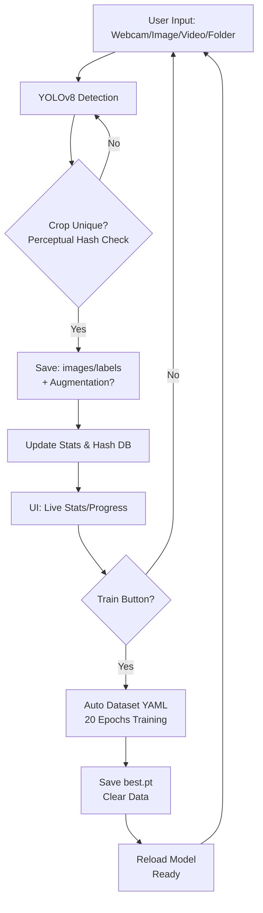

# Real-Time Animal Detection Web App (YOLOv8 + Flask)

A **browser-based** real-time animal detection, dataset collection, and auto-training system using **YOLOv8** and **Flask**.

**Key Transformation**: Converted from desktop Tkinter app to modern **web application** with TailwindCSS UI, live video streams, drag-and-drop uploads, and real-time training progress.

Detect animals from webcam, images, videos, or folders. Automatically saves unique crops (with perceptual hashing), supports data augmentation, and trains custom models via intuitive web interface.

---

## Key Features

### Live Web UI Tabs

| Tab              | Capabilities                                                                                     |
| ---------------- | ------------------------------------------------------------------------------------------------ |
| Live Camera      | Real-time webcam detection + auto-save crops                                                     |
| Media & Folders  | Image uploads, folder processing (named by animal), data augmentation toggle (auto-flips images) |
| Process Video    | Upload/process videos frame-by-frame                                                             |
| Training & Stats | Live dataset stats, start training, progress bar, download custom .pt model, delete animal data  |

### Detection & Collection

- **YOLOv8** inference (GPU/CPU auto-detect).
- **Perceptual hashing** rejects >85% similar images.
- **Dynamic animals**: 18+ classes (bear, camel, deer, donkey, elephant, giraffe, goat, lion, monkey, pig, sheep, tiger, wolf, zebra + core).
- Auto-creates `images/`, `labels/`, `coords/` per animal.

### Training Pipeline

- User-triggered via web UI (no auto-threshold).
- **20 epochs** with live progress (epoch/batch %).
- Saves `best.pt` to `project_data/weights/`, auto-loads next session.
- Auto-generates `data_auto.yaml` and `train_images.txt`.
- Clears data post-training.

### Smart Features

- **Augmentation**: Optional horizontal flips (doubles dataset).
- **Confirmation modals** for training/delete.
- **Toast notifications** & loading overlays.
- Model download button.

---

## System Workflow

1. **Detect** animals → Draw boxes + confidence %.
2. **Crop & hash** → Save if unique (images/labels).
3. **Folder uploads** → Override label by folder name.
4. **Monitor stats** → Per-animal image counts.
5. **Train** → Background task, live updates.
6. **Download** → Custom model weights.

---

## Project Structure

```
project_data/
├── train/
│   ├── bear/     ├── camel/     ├── deer/
│   │   ├── images/    ├── labels/
│   └── ... (per animal)
├── uploads/          (temp videos)
├── weights/          (*.pt models)
├── hash_db.json      (duplicate tracking)
├── progress.json     (live training status)
└── new_animals.txt   (dynamic classes)

templates/
└── index.html       (Tailwind UI)

animal_trainer.py     (Flask app)
```

---

## Web UI Highlights

- **Responsive TailwindCSS** design (mobile/desktop).
- Real-time **video streams** (MJPEG).
- **Progress bars** for folder processing/training.
- **Live stats** with delete buttons.
- **Drag folders** named by animal (e.g., `my_bird_folder/`).

---

## Requirements

```bash
pip install flask ultralytics opencv-python pillow imagehash torch pyyaml numpy
```

**GPU**: CUDA + PyTorch auto-detected.

---

## Quick Start

```bash
cd "c:/Users/Sami/Desktop/Progects/Real-Time-Animal-Detection"
python animal_trainer.py
```

**Opens**: http://127.0.0.1:5000  
**Access**: Webcam/Images/Videos/Training in browser.

---

## Training Details

- **Auto dataset prep**: Scans `train/*/images/`.
- **Callbacks**: Real-time epoch/batch updates.
- **Cleanup**: Resets data after successful training.
- **Best model**: `custom_<timestamp>_best.pt`.

---

## Data Controls

- **Duplicate filter**: Hamming distance on perceptual hashes.
- **Augmentation**: Saves original + flipped.
- **Delete animal**: Removes folder + hash DB entry.

---

## Tech Stack

- **Backend**: Flask, YOLOv8 (Ultralytics), OpenCV, PyTorch.
- **Frontend**: HTML5, TailwindCSS, vanilla JS (no frameworks).
- **Utils**: PIL, imagehash, NumPy, YAML/JSON.

---

## Use Cases

- Wildlife cams → Auto dataset building.
- Custom animal training (farms, zoos).
- Edge device prototyping.
- Continuous learning CV research.

## Flowchart



## Future Enhancements

- Training history persistence.
- Multi-model switching.
- API endpoints.
